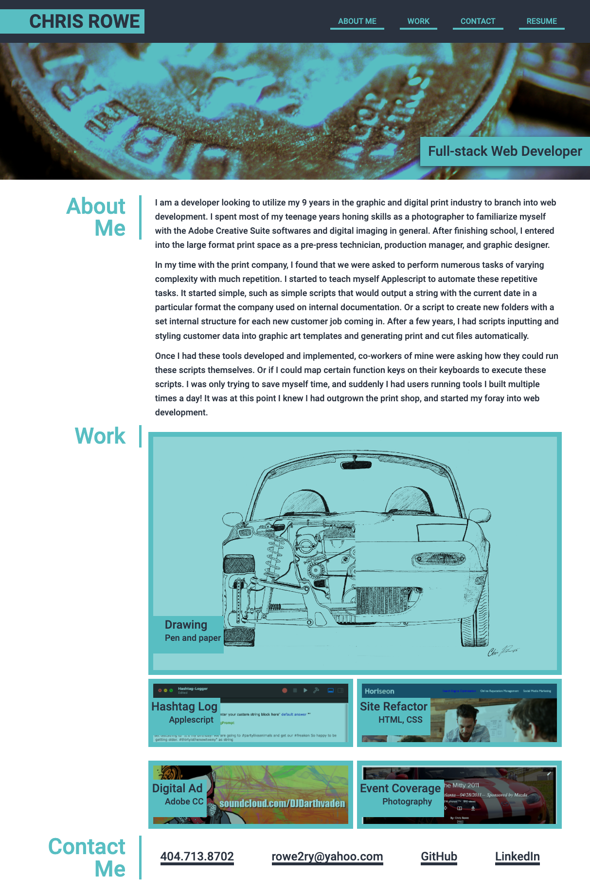

# Advanced CSS Portfolio Page
A version of my portfolio laid out to a pre-defined mockup created by an outside source.

## How to access project

This project is deployed live on my GitHub. You can access it with the following link.

[CSS Portfolio Page](https://rowe2ry.github.io/CSS-Portfolio-match-existing-mockup/)

## Usage:

This page is a portfolio of some of my current favorite works. The center focus project is my full-stack online automotive school project, Overdrive. The other featured projects are mostly various Javascript projects that were done as educational exercises. It should be noted that the styling of this page has been **done in such a way to match a given mockup as part of a challenge given to me** . These colors, layout, and effects are chosen to match a given layout, and are not necessarily representative of my chosen aesthetic (though I do think it all looks quite nice myself).

### Project Preview

### Mobile Layout

Page also supports responsive styling for viewing on smaller devices.

## Contributions

Pull requests welcome. Feel free to play with the code or leave feedback about the project.

## License

MIT